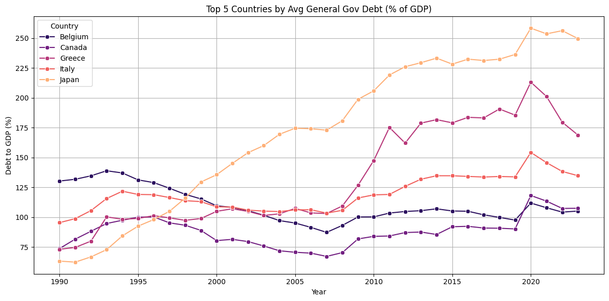
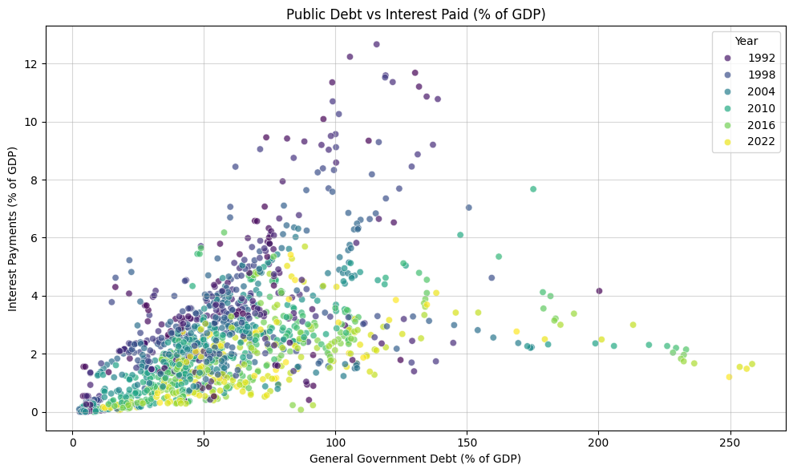

# International Debt Analysis

## Overview

A comprehensive, data-driven exploration of **global debt dynamics**, analyzing trends in public, household, and corporate debt across countries and decades. It examines the interplay between debt levels and **macroeconomic indicators** like inflation, unemployment and economic stress, especially around major global crises (e.g. 2008 & 2020).

This project uses Python, pandas and rich visualizations (Plotly, Matplotlib, Seaborn) to uncover insights from international economic data sourced from the IMF ([International Monetary Fund](https://www.imf.org/external/datamapper/datasets)) and BIS ([Bank for International Settlements](https://data.bis.org/topics/DSR/data)).


## Feautures
- Custom-built **data processing pipeline** with missing data handling & imputation
- **Time-series and scatterplot** analyses of debt metrics
- **Crisis impact** visualization (2008, 2020)
- Interactive & **animated** visualizations

### Key Metrics Analyzed
| Metric               | Description               | Unit     |
| -------------------- | ------------------------- | -------- |
| `Govt_Debt_GDP`      | Government Debt           | % of GDP |
| `Interest_Paid_GDP`  | Interest Payments on Debt | % of GDP |
| `Household_Debt_GDP` | Household Debt            | % of GDP |
| `Corporate_Debt_GDP` | Corporate Debt            | % of GDP |
| `Inflation`          | Consumer Price Index      | % YoY    |
| `Unemployment`       | Labor Force Unemployment  | %        |
| `Population_mn`      | Population                | Millions |

**Note:** <br>
-Nonfinancial Public Sector Debt (`Public_Sector_Debt_GDP`): <br>
It broader than general government debt, includes General government debt plus State-owned enterprises (SOEs) and public agencies that are nonfinancial. <br>
-Nonfinancial Corporate Debt (`Corporate_Debt_GDP`): <br>
Refers to debt held by private sector companies that are not in the financial industry (i.e., not banks, insurers).


### Contents
1. Which countries have the highest or lowest General Government Debt (% of GDP) over time? 
2. Do countries with higher public debt have higher interest payments (% of GDP)?
3. What happens to debt levels and interest payments around major global crises (e.g., 2008, 2020)?
4. Does corporate debt compare with household debt in different economies? 
5. Do countries with higher public debt also have higher inflation?
6. How does debt burden relate to economic stress across different countries and time periods?







## Key Takeaways

### Crises Drive Debt Surges
Debt levels tend to spike during global crises. After the 2008 crash and the COVID-19 pandemic, average public debt jumped from ~45% to over 75% of GDP. Japan stands out with debt over 250% of GDP by 2020 — yet it keeps interest payments low due to domestic investors and near-zero rates.

### Debt Sustainability Varies
There’s no single “danger zone” for debt. Many countries with debt below 100% of GDP keep interest payments under 5%, while those above 150% face more mixed outcomes. It turns out how debt is financed matters more than how much you owe.

### Changing Private Debt Patterns
Household debt rose sharply in the 2000s (e.g. Netherlands, Cyprus), while corporate debt took the lead post-2010. Some economies now show high debt in both sectors — a potential risk for financial stability.

### Inflation Isn’t Always Tied to Debt
High debt doesn’t automatically mean high inflation. While countries like Greece saw both rise during crises, others like Japan have had huge debt and low inflation for decades.

### Debt vs. Economic Stress
Not all high-debt countries are in trouble. A 2022 snapshot shows that some nations with debt over 100% of GDP are doing fine, while others with less debt struggle more. Stress depends on factors like inflation, unemployment and how debt is managed — not just the number itself.

## Setup Instructions

### Clone the repository (or Download):

```
git clone https://github.com/Anastasis-Kon/International-Debt-Analysis.git
cd International-Debt-Analysis
```
###  Requirements:

- **Python 3.10+**
- **Datasets**

### Install dependencies with:

```sh
py -m pip install --upgrade pip # Optional
pip install -r requirements.txt
```
or this for the latest packages
```
pip install pandas numpy matplotlib seaborn plotly openpyxl nbformat ipykernel
pip check
```
**Optional**: Create and activate a virtual environment or install <br>
 `jupyterlab>=3.0  # Only if user want to run the notebooks in browser-based Jupyter`


### Data Access Instructions

This project uses publicly available data from:

- [IMF – Datasets](https://www.imf.org/external/datamapper/datasets)
- [BIS – Debt Statistics](https://data.bis.org/topics/DSR/data)

**! Due to licensing restrictions, the raw Excel files are not included in this repository.**

**IMF Datasets**
- From IMF - **World Economic Outlook** Dataset download:
    - **GDP, current prices (Billions USD)**
    - **Inflation rate, average consumer prices**
    - **Population**
    - **Unemmployment rate**
- From IMF - **Global Debt Database** download:
    - **General Government Debt**
    - **Nonfinancial Public Sector Debt**
    - **Nonfinancial corporate debt, all instruments**
    - **Household debt, all instruments**
-  From **IMF - Public Finances in Modern History** download:
    - **Interest paid on public debt** 

**BIS Datasets** 
- From **BIS - Debt service ratios**:
    - Navigate to Sample tables
    - Select:
        - **Households**
        - **Nonfinancial corporate**
    - In Filters, adjust the time span to 1999–2024
    - Export as Table and Excel each table.

**Processing**
- Place the Excel files into a folder named `Data/`.
- Run the `Data_Processing.ipynb` script to generate `Processed_Data.csv`.

You can also **skip this step** and directly use the provided output **.CSV** for exploratory analysis.

## Methodology 

This project follows a structured data preparation pipeline to ensure economic analysis across countries and time. Below is a step-by-step breakdown of the methodology:

### 1. Data Collection
- All source files are located in the `Data/` folder.
- Excel files from IMF (macroeconomic indicators like GDP, inflation, unemployment, government debt), no processing requiered.
- Excel files from BIS (debt service ratios for households and corporates), processing described below.
- Each Excel file is loaded into a list of pandas DataFrames.


#### Processing BIS Data

This Power Query transformation converts quarterly debt service ratio data from wide format (countries as rows, dates as columns) into an annual summary format suitable for analysis.
#### Transformation Process
Input Data: Excel table with 96+ quarterly columns spanning 1999-2024 (quarterly snapshots: March 31, June 30, September 30, December 31).
Key Steps:
1. Data Type Standardization: Converts all quarterly date columns to numeric type and country names to text
2. Unpivot Operation: Transforms wide format to long format (each country-date becomes separate row)
3. Year Extraction: Creates year column from quarterly date strings using Date.Year(Date.From([Attribute]))
4. Annual Aggregation: Groups by country and year, calculates average of quarterly values
5. Final Pivot: Converts back to wide format with years as columns

Result: Clean country-by-year matrix optimized for time series analysis and cross-country comparisons.

### 2.  Year Selection Analysis
- For each metric, we calculate the percentage of missing data across all available years.
- These are compiled into a missing data matrix, showing metric completeness by year.
- A visualization of missing data trends guides the selection of the optimal time period.


### 3. Country Selection Analysis
- For each country and each metric, we compute the average missing data percentage during the selected period
- Only retain countries with ≤30% missing data in any metric.

### 4.  Data Imputation
- To fill small gaps while preserving data integrity, we apply linear interpolation
- Any rows with remaining missing data are dropped after imputation.

### 5. BIS Data Integration
- BIS debt service ratio datasets (households and corporates) are handled separately due to differing structure.
- These are processed individually, converted to annual format (from quarterly) and added to the main dataset.

### 6. Format Transformation (Long Format)
All processed data are transformed into a long-format DataFrame with the structure: <br> 
` Metric | Country | Year | Value`


## Further Exploration
This project uses a subset of available indicators from the IMF and BIS datasets. The full databases contain many more metrics that can support deeper and more targeted economic questions.

### Possible Extensions
- Use APIs to access real-time or complete datasets:
    - IMF provides a public JSON REST API for programmatic data access.
    - BIS also allows structured data downloads and API-like access for batch retrieval.
- Expand the analysis by incorporating:
    - Government revenue / fiscal balance
    - Monetary policy indicators (e.g. interest rates, money supply)
    - GDP growth, exchange rates, current account balances
- Automate updates:
    - Periodically pull the latest data via API to refresh your analysis
    - Schedule data cleaning scripts and analysis runs

## --Disclaimer--
This project is intended as a data analysis and visualization exercise, not a professional economic assessment. While it uses real economic data and applies structured analytical methods, it does not claim to follow academically rigorous or policy-approved economic modeling practices.


## File Structure
```
├── .gitignore
├── requirements.txt         # Package requirements
├── Data_Processing.ipynb    # Full data processing pipeline
├── Data_Analysis.ipynb      # Analytical insights and rich visualizations
├── Processed_Data.csv       # Final clean long-format dataset
├── Images/                  # Folder for graph images
├── Data/                    # Folder to upload the excel files
└── README.md                # You're reading it!
```
